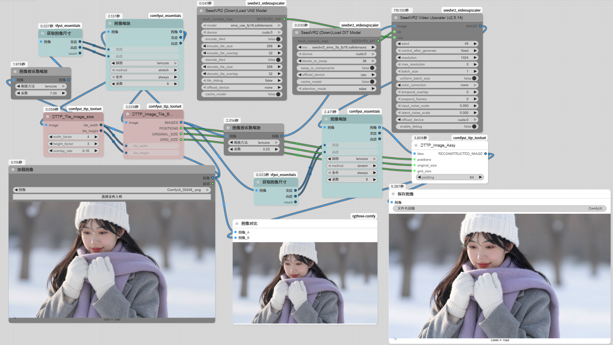

## SeedVR2超真实分辨率图像极限放大工作流（中文｜English）

**一个专为“极限放大任意图像”打造的一键式超高倍率无损放大工作流**
A one-click extreme image upscale workflow using `SeedVR2 + smart tiling` (supports 7x+ magnification with almost no quality loss).

功能 | Features

|    功能   |      说明      |
|---------|----------|
| 智能瓦片分割（TTP Toolset） | 自动将大图切成 1024×1024 瓦片，完美避免`显存爆炸` |
| SeedVR2 超真实分辨率 | 单张图像极限放大（支持`7倍`以上，细节自然电影感 |
| 智能尺寸计算与重组 | 自动计算瓦片大小、重采样、精确`重组`原图比例|
| rgthree-comfy  | `Image Comparer节点`实时滑动对比原图 vs 极限放大结果 |
| ComfyUI-Easy-Use 显存释放 |全程显存峰值减少  |

### 所需模型（与 Z-Image 工作流完全共享，无需额外下载）

| 节点               | 文件名                            | 放置路径                        | 下载链接|
|-------------------|-----------------------------------|--------------------------------|--------------|
| SeedVR2 DiT Model    | `seedvr2_ema_3b_fp16.safetensors` | `ComfyUI\models\SEEDVR2\`   |https://huggingface.co/numz/SeedVR2_comfyUI/tree/main|
| SeedVR2 VAE Model    | `ema_vae_fp16.safetensors`        | `ComfyUI\models\SEEDVR2\`   |https://huggingface.co/numz/SeedVR2_comfyUI/blob/main/ema_vae_fp16.safetensors|

### 必装自定义节点（已在上方 Z-Image 章节列出，无需重复安装）

打开 ComfyUI → Manager → 搜索插件名 → Install → 重启 ComfyUI 即可。

|  节点包名称  |  GitHub 仓库地址  |  主要作用  |  必装/可选  |
|-------------|------------------|------------|-----------|
|comfyui_ttp_toolset| https://github.com/TTPlanetPig/Comfyui_TTP_Toolset |提供瓦片`分割`与`重组`节点|必装
|comfyui_essentials| https://github.com/cubiq/ComfyUI_essentials |提供`高级尺寸调整`|必装
|rgthree-comfy | https://github.com/rgthree/rgthree-comfy |`对比器`|必装|
|SeedVR2 Video Upscaler| https://github.com/numz/ComfyUI-SeedVR2_VideoUpscaler |`核心超分`|必装|

### 使用方法 | How to Use

1. 将本仓库中的`图像极限放大.json`拖入ComfyUI 界面
2. 在画布双击搜索`Load Image` 节点上传您想放大的任意图像（`支持超大图`）
3. 点击`运行`全程自动完成
4. 生成图片结果自动保存到`ComfyUI/output/`并可通过`rgthree-comfy`插件节点滑动条实时对比

### 推荐参数（已预设，可微调）
- 输入图片大小：`1024×1024`或`1920x1080`（速度与质量）
- 图像缩放倍率：`7倍`（可改更高，显存会略增）
- SeedVR2 分辨率：`1024`（固定瓦片分辨率，过大速度下降）
- TTP_Tile_image_size大小 输入图片`尺寸大小`宽大于高时，`width_factor` =` 4(3)`，`height_factor` = `3(2)`
- TTP_Tile_image_size大小 输入图片`尺寸大小`高大于宽时，`width_factor` =` 3(2)`，`height_factor` = `4(3)`

### 示例效果 | Samples

|工作流演示|
|---------|
||

| 原图                  | 极限放大后（7 倍放大示例）                  |
|-----------------------|---------------------------------------|
|  |  |

> 可轻松将小图放大到 `2K` 以上，细节清晰无糊  
> 支持风景、人像、插画等所有类型图像

